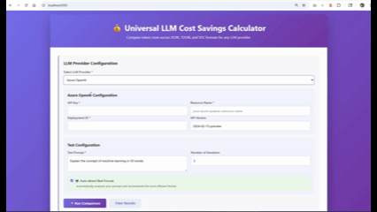

# Universal LLM Cost Savings Calculator 💰

Compare token costs across **JSON**, **TOO**, and **VSC** formats for any LLM provider.

---

## 🖼 Demo Screenshot


---

## 🚀 Overview
This tool helps developers and AI practitioners analyze token usage and cost implications of different output formats when interacting with Large Language Models (LLMs). It supports providers like:
- Azure OpenAI
- OpenAI
- Google Gemini
- Anthropic Claude
- Databricks
- Ollama (Local)
- Generic/Custom APIs

---

## ✅ Features
- Compare token counts for JSON, TOO, and VSC formats
- Validate against multiple LLM providers
- Auto-detect best format for your prompt
- Visual charts for token usage
- Accuracy check for response integrity

---

## 📂 How to Use

### **Option 1: Run Directly in Browser**
1. Clone the repo:
   ```bash
   git clone https://github.com/3125ravi/llm-cost-savings-calculator.git
   ```
2. Navigate to the project folder and open the HTML file:
   ```bash
   cd llm-cost-savings-calculator
   open index.html
   ```
   *(On Windows, double-click the file. On macOS/Linux, use your default browser.)*
3. Configure your LLM provider and test prompt.
4. Click **Run Comparison** to see token usage and cost analysis.

---

### **Option 2: Run via Node.js (Local Server)**
1. Install a simple HTTP server globally (if not installed):
   ```bash
   npm install -g http-server
   ```
2. Navigate to the project folder:
   ```bash
   cd llm-cost-savings-calculator
   ```
3. Start the server:
   ```bash
   npx http-server
   ```
4. Open the local URL provided by the server (e.g., `http://localhost:8080`) in your browser.

---


## ⚠️ Notes
- Cost calculations are estimates based on standard pricing models.
- Actual costs may vary depending on provider pricing tiers and discounts.

---

## 📌 Tags
`LLM` `Tokenization` `Cost Optimization` `Azure OpenAI` `OpenAI` `Prompt Engineering` `Generative AI`

